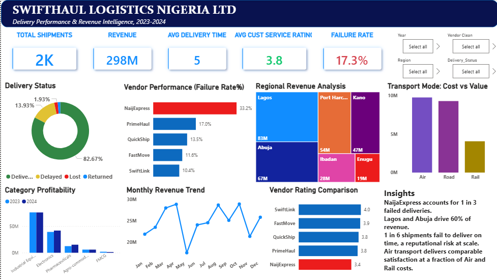

[swifthaul-README.md](https://github.com/user-attachments/files/28213965/swifthaul-README.md)
# SwiftHaul-Analysis
A Power BI dashboard built to diagnose delivery failures, vendor reliability and revenue concentration across SwiftHaul Logistics Nigeria's operations for 2023–2024.
# SwiftHaul Logistics Nigeria — Delivery Performance & Revenue Intelligence Dashboard 🚚

A Power BI dashboard built to diagnose delivery failures, vendor reliability, and revenue concentration across SwiftHaul Logistics Nigeria's operations for 2023–2024.

---

## Problem Statement

With a 17.3% failure rate across 2,000+ shipments, SwiftHaul needed visibility into *where* failures were happening, *which vendors* were responsible, and *which regions* were generating the most value — so leadership could act on the right problems first.

---

## Dashboard Overview

| Metric | Value |
|---|---|
| Total Shipments | 2,000+ |
| Total Revenue | ₦298M |
| Avg Delivery Time | 5 days |
| Avg Customer Service Rating | 3.8 / 5 |
| Overall Failure Rate | 17.3% |

**Tool:** Power BI  
**Data period:** 2023 – 2024  
**Scope:** 5 vendors, 6 regions, 3 transport modes, 5 product categories

---

## Key Visuals

- **Delivery Status Donut** — 82.67% delivered on time; 13.93% delayed; 1.93% lost; remaining returned
- **Vendor Performance (Failure Rate %)** — NaijaExpress flagged at 33.2% failure rate — more than double the next vendor (PrimeHaul at 17%)
- **Regional Revenue Analysis** — Lagos (₦83M) and Abuja (₦67M) together account for over 50% of total revenue
- **Transport Mode: Cost vs Value** — Air and Road deliver comparable revenue; Rail significantly underperforms
- **Category Profitability (2023 vs 2024)** — Industrial Equipment and Electronics are the top-performing categories
- **Monthly Revenue Trend** — Revenue peaks mid-year with notable dips in May and October
- **Vendor Rating Comparison** — SwiftLink holds the highest customer rating (4.0); NaijaExpress lowest (3.4)

---

## Key Insights

- **NaijaExpress accounts for 1 in 3 failed deliveries** — a reputational and operational risk at scale; contract review recommended
- **Lagos and Abuja drive 60% of revenue** — the business is heavily region-concentrated; diversification or deeper penetration of Port Harcourt and Kano could reduce risk
- **1 in 6 shipments fails to deliver on time** — at this volume, that's hundreds of customer experience failures per year
- **Road transport delivers comparable satisfaction at a fraction of Air costs** — a cost optimisation opportunity the data makes hard to ignore

---

## Skills Demonstrated

- Multi-dimensional logistics data analysis in Power BI
- DAX measures for failure rate, average delivery time, and revenue aggregation
- Vendor benchmarking and performance comparison
- Regional revenue mapping with treemap visuals
- Business insight generation with actionable recommendations

---

## Dashboard Preview

---

## Tools Used

`Power BI` `DAX` `Data Modelling` `Logistics Analytics` `Data Visualisation`
